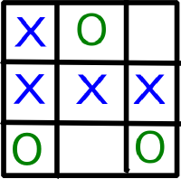
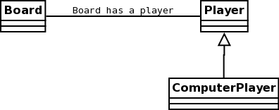
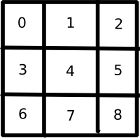

Tic-Tac-Toe
==============

Problem Statement
-------------------
::

  Create a console program that can interactively play the game of Tic-Tac-Toe
  against a human player.

I always like starting with a general problem of what needs to be built.  Lets
break down what is in a tic-tac-toe game. First thing I think of is the board.
This board is a 3 x 3 grid which gives us 9 cells to deal with. A player takes
turn placing there marker in one of the cells on the board.  The marker is
usually an "X" or an "O".  

.. Create a program that can interactively play the game of Tic-Tac-Toe
.. against a human player and never lose.

Create a Project
-----------------

The first thing that needs to be done is create a project space

.. code-block:: bash
  
  $ bundle gem tic-tac-toe
  create  tic-tac-toe/Gemfile
  create  tic-tac-toe/Rakefile
  create  tic-tac-toe/.gitignore
  create  tic-tac-toe/tic-tac-toe.gemspec
  create  tic-tac-toe/lib/tic-tac-toe.rb
  create  tic-tac-toe/lib/tic-tac-toe/version.rb
  Initializating git repo in ./tic-tac-toe
  
This creates a basic project structure and sets up an git repository for you.
The Gemfile is a Bundler file that keeps track of the dependencies of the
application.  We will see more about this later.  

The Rakefile is an Task master.  Basically Rake is a command line utility for
running tasks similar to an make file or an ant build script. it gives you the
ability to run tests and package up your application.  I will show the testing
in a little bit. The packaging we will discuss at the end of this chapter.  

The gemspec file defines the project information such as name and description and author information on a project.  We will edit 
that information when we start discussing packaging 

The lib directory is the directory that we put all our source code. Bundler creates a starter file that is the same name as the 
project.  It also created a directory by that same name.  Inside the directory you see a file called version.rb. 

At this point I would create the initial commit to my source control system.  I use git for most of my projects.  

.. code-block:: bash
  
  $ git add .
  $ git commit -m "Initial Project Create"
  
I usually try to keep my commits to a repository small and concise to one topic.  I will periodically show my commit points 
in the book. Now that we have been introduced to the basic project structure lets get on with the project.

Creating the Board
-------------------

Ok now it's time to get down to the hard core stuff.  First thing we are going to create is the test.  I like using a 
process called TDD or Test Driven Development.  This process is where you create a test first. Then show that it fails. 
Then you write the code to make the test pass.  So we need to create a new directory in the project under the tic-tac-toe directory.

.. code-block:: bash

  $ mkdir test
  $ touch test/board_test.rb
  
if you are using redcar or another edit you can right click in the white space and select "New Directory".  Enter the name test.  
Then if you right click the test folder created and select "New File" and name it board_test.rb.  

Open board_test.rb so we can start creating our test

.. code-block:: ruby
  :linenos: 
  
  require 'test/unit'
  $LOAD_PATH << File.expand_path(File.join(File.dirname(__FILE__), "..", "lib"))
  require "tic-tac-toe/board"
  
  class BoardTest < Test::Unit::TestCase
    def test_board_create
      board = TicTacToe::Board.new 
      assert_not_nil(board, "Failed to create board")
      assert_equals board.size, 9 
    end
  end 

.. note::

  I know line 2 looks like a nightmare, but it's kind of simple, I am getting the dirname of the current file("test/board_test.rb")
  adding the ../lib to that path string.  Then it expands that string it creates a full absolute path string and the "<<" means to 
  push that string on top of the load path.  this way it can find the location of the classes we write for the test

The focus points we need to look at are lines 7 - 9.  We create a new instance of the Board class on line 7.  Then on line 8 we 
check to see if the board was created successfully by checking to see if the board object has been created.  As well as checking 
the size of the board on line 9.  So lets run the test. 

.. code-block:: bash
  
  $ ruby test/board_test.rb
  
:: 

  Loaded suite board_test
  Started
  E
  Finished in 0.001124 seconds.
  
    1) Error:
  test_board_create(BoardTest):
  NameError: Missing or uninitialized constant: BoardTest::TicTacToe
      kernel/common/module.rb:529:in 'const_missing'
      board_test.rb:5:in 'test_board_create'
      kernel/bootstrap/array.rb:71:in 'each'
      kernel/bootstrap/array.rb:71:in 'each'
  
  1 tests, 0 assertions, 0 failures, 1 errors

I know what you are thinking "Oh Lord ... I see errors what happened."  I expected this to happen.  First you have to fail to
understand how to pass.  We see here we have a NameError in the test.  This means that it does not understand what is meant by 
TicTacToe.  Ok lets try and fix this. First we need to create the board file "lib/tic-tac-toe/board.rb".  

.. code-block:: ruby
  :linenos:
  
  module TicTacToe
    class Board
      GRID_SIZE = 8
      attr_reader :grid
      def initialize()
        @grid = []
        (0..GRID_SIZE ).each {|x| @grid[x] = nil } 
      end
      def size
        @grid.size
      end
    end
  end

Lets run the test to see if we are successful 

.. code-block:: bash

  $ ruby test/board_test.rb
  Loaded suite test/board_test
  Started
  .
  Finished in 0.0016409999999999999 seconds.
  
  1 tests, 2 assertions, 0 failures, 0 errors

.. note::
  This would be a good place to commit your code to the source repository.

Now that we have the code for a basic class in place, Lets discuss it.

First thing we see in this code is the module statement.  Module is used to
define a logical seperations in code.  A module can contain method defnitions,
class definitions, and even other module defnitions.  Modules can be included in
other modules or classes with the simple:

.. code-block:: ruby

  include <Module Name>
  
The next thing on line 2 is the class statement.  Creating a class is like
defining a blueprint for a building.  Calling dot new on a class, constructs the
class in memory and runs the initialize method.

What the initialize method is use for is to create and initialize the base
values used by the class.  The first thing that is initialized is the grid
variable on line 6.  The at(@) symbol in front of the name means that it's an
instance variable.  Instance variables live inside the object that is created 
in memory.  Line 7, inside the porrenthses, is called a range. A range is a
counter that will count from 0 to 8. The each method that is called off that
range will be executed every time.  The code that is inside the curly braces is
a single line block of code.  That code is what gets run every time the range
counts, nil is being put on the array at that location. Once that counter hits 8
it stops.

.. note::
  Nil is a special object in ruby. It repesents a non-existant state.
    
Lines 9-11 define a method called size.  This method returns the size of the
grid array.  Return is an implicit keyword, meaning that I dont' have to type it. 
Ruby will automaticly return the results of the last line in a method.

Place Marker
^^^^^^^^^^^^^^^^

Now that we understand what how this works so far, we need to add a method that
allows us to place a marker on the grid. Also raise an error if the a marker is
placed outside of the board or if the marker is palced on top of a already taken
cell.  Back to the board_test.rb:

.. code-block:: ruby
  :linenos:
  
  ...
  def test_place_marker
    board = TicTacToe::Board.new
    board.place_marker(4, "X")
    assert_equal board.grid[4], "X"
    assert_raise TicTacToe::BoardError {board.place_marker(9,"O")}
    assert_raise TicTacToe::BoardError {board.place_marker(4, "X")}
  end
  ...

.. code-block:: bash

  $ ruby test/board_test.rb
  Loaded suite test/board_test
  Started
  .E
  Finished in 0.002139 seconds.
  
    1) Error:
  test_place_marker(BoardTest):
  NoMethodError: undefined method 'place_marker' on an instance of TicTacToe::Board.
      kernel/delta/kernel.rb:85:in 'place_marker (method_missing)'
      test/board_test.rb:15:in 'test_place_marker'
      kernel/bootstrap/array.rb:71:in 'each'
      kernel/bootstrap/array.rb:71:in 'each'
  
  2 tests, 2 assertions, 0 failures, 1 errors

Notice when i run the test as expected the test fails.  This test is simular to
the first one.  One thing to point out is the assert_raise method.  it check to
see if the code raises an error when certin conditions are met.

Now lets write the place marker method on the board class

.. code-block:: ruby
  :linenos:
  
  ...
  def place_marker(index, marker)
    @grid[index] = marker
  end
  ...

Time to run it and see what we get.

.. code-block:: bash

  $ ruby test/board_test.rb
  Loaded suite test/board_test
  Started
  .E
  Finished in 0.002041 seconds.
  
    1) Error:
  test_place_marker(BoardTest):
  NoMethodError: undefined method 'BoardError' on an instance of BoardTest.
      kernel/delta/kernel.rb:85:in 'BoardError (method_missing)'
      test/board_test.rb:17:in 'test_place_marker'
      kernel/bootstrap/array.rb:71:in 'each'
      kernel/bootstrap/array.rb:71:in 'each'
  
  2 tests, 3 assertions, 0 failures, 1 errors

Oh no what did I do wrong.  There is no BoardError defined.  So lets create
that. Go to the lib/tic-tac-toe/board.rb file and add:

.. code-block:: ruby
  :linenos:

  class BoardError < Exception
  end

Now rerun the test again:

.. code-block:: bash

  $ ruby test/board_test.rb
  Loaded suite test/board_test
  Started
  .F
  Finished in 0.069226 seconds.
  
    1) Failure:
  test_place_marker(BoardTest)
      [test/board_test.rb:17:in 'test_place_marker'
       kernel/bootstrap/array.rb:71:in 'each'
       kernel/bootstrap/array.rb:71:in 'each']:
  <TicTacToe::BoardError> exception expected but none was thrown.
  
  2 tests, 4 assertions, 1 failures, 0 errors

Well it failed.  Was that what we exepcted? not really so how do we fix this. We
need to add the raise statement to the place_marker method.

.. code-block:: ruby
  :linenos:
  
  ...
  def place_marker(index, marker)
    if index < 0 or index > GRID_SIZE 
      raise BoardError.new, "#{index} is outside the board"
    end
    if @grid[index].nil?
      @grid[index] = marker
    else
      raise BoardError.new, "#{index} is already used"
    end
  end
  ...
  
Time to run the test again and see what that says:

.. code-block:: bash

  $ ruby test/board_test.rb
  Loaded suite test/board_test
  Started
  ..
  Finished in 0.002402 seconds.
  
  2 tests, 5 assertions, 0 failures, 0 errors

Yay, the test passes.  Time to explain what is going on.

.. note::
  Test passing is always a good time to commit back to source control.
  
Now lets start with the defnition of the place_marker method on line 2.  The if
statement on line 3 starts a decision block.  Basicaly if the index is not
between 0 and 8 then execute line 4. This line raises an error called a
BoardError, with the message "#{index} is outside the board".  The "#{index}" is
injecting the value of index into the string, so if index = 9 then it would
print "9 is outside the board".  The raise statement also stops execution of the
mehtod, so nothing after the error was raised was executed.

After we have made it through the first if we come to check if the block on the
board is empty.  "nil?" will return true for false depending if a nil exists in
the object we are calling the method on.  In this case if the cell is nil then
place the marker there if not rase an error that the cell is already taken.

Clearing the Board
^^^^^^^^^^^^^^^^^^^^^^
Now that we can place markers on the board, we need a way to clear the board.
To test this should be simple as these steps:

1. Place a marker on the board
2. Assert that the marker is there
3. Call clear on the board
4. Assert that that cell is nil

So lets put this to code. Create a new test method in board_test.rb

.. code-block:: ruby
  :linenos:
  
  ...
  def test_clear_board
    board = TicTacToe::Board.new
    board.place_marker(4, "X")
    assert_equal board.grid[4], "X"
    board.clear
    assert_nil board.grid[4]
  end
  ...

.. code-block:: bash

  $ ruby test/board_test.rb
  Loaded suite test/board_test
  Started
  .E.
  Finished in 0.003509 seconds.
  
    1) Error:
  test_clear_board(BoardTest):
  NoMethodError: undefined method 'clear' on an instance of TicTacToe::Board.
      kernel/delta/kernel.rb:85:in 'clear (method_missing)'
      test/board_test.rb:25:in 'test_clear_board'
      kernel/bootstrap/array.rb:71:in 'each'
      kernel/bootstrap/array.rb:71:in 'each'
  
  3 tests, 6 assertions, 0 failures, 1 errors
  
Now we have our failing test lets code the clear method:

.. code-block:: ruby
  :linenos:
  
  ...
  def clear
    @grid.clear
  end
  ...
  
.. code-block:: bash

  $ ruby test/board_test.rb
  Loaded suite test/board_test
  Started
  ...
  Finished in 0.0025109999999999998 seconds.
  
  3 tests, 7 assertions, 0 failures, 0 errors

Line 3 is the focus point for this method.  Clear is a method on an array that
removes all items from the array.

Checking the Board for a winner
^^^^^^^^^^^^^^^^^^^^^^^^^^^^^^^^

The next challenge we have is to check the board and see if there is a winner
present.  so lets take a look at a board and see what we can tell.

   
  
As we can see by the board pattern analsys show that there are 8 winning
patterns. The patterns can be broken up into 3 sections.  The horizontial
patterns such as [0,1,2], [3,4,5], and [6,7,8].  The virtical patterns are
[0,3,6], [1,4,7], and [2,5,8].  The diagnogal patterns are [2,4,6] and [0,4,8].
So with this knowlage lets create a constant for winning patterns in the board
class. To decleare a constant you start the name with a capitial.  

.. code-block:: ruby
  :linenos:
  
  ...
  WINNING_PATTERNS = [
      [0,1,2],
      [3,4,5],
      [6,7,8],
      [0,3,6],
      [1,4,7],
      [2,5,8],
      [2,4,6],
      [0,4,8],
    ]
  ...

With the patterns declared we can write the test to check the winners.

.. code-block:: ruby
  :linenos:
  
  ...
  def test_check_board
    board = TicTacToe::Board.new
    board.place_marker(3, "X")
    board.place_marker(4, "X")
    board.place_marker(5, "X")    
    board.check_winner
    assert_equals board.winner, "X" 
  end
  ...

This test tests only one possible case of the horizontal center row.  Lets
rewrite the test to loop through the pattern array and test each condition.

.. code-block:: ruby
  :linenos:
  
  ...
  def test_check_board
    board = TicTacToe::Board.new    
    TicTacToe::Board::WINNING_PATTERNS.each do |pattern|
      board.place_marker(pattern[0], "X")
      board.place_marker(pattern[1], "X")
      board.place_marker(pattern[2], "X")
      assert board.check_winner
      assert_equals board.winner, "X"
      board.clear
    end     
  end
  ...

Now we run the test.

.. code-block:: bash
  
  $ ruby test/board_test.rb
  Loaded suite test/board_test
  Started
  .E..
  Finished in 0.003186 seconds.
  
    1) Error:
  test_check_board(BoardTest):
  NoMethodError: undefined method 'check_winner' on an instance of TicTacToe::Board.
      kernel/delta/kernel.rb:85:in 'check_winner (method_missing)'
      test/board_test.rb:35:in 'test_check_board'
      kernel/bootstrap/array.rb:71:in 'each'
      test/board_test.rb:31:in 'test_check_board'
      kernel/bootstrap/array.rb:71:in 'each'
      kernel/bootstrap/array.rb:71:in 'each'
  
  4 tests, 7 assertions, 0 failures, 1 errors

Ok, lets look at the test before we code the check_board mehtod.  On line 4 we
see ".each do |pattern|" hanging off the WINNING_PATTERNS constant. The each
method iterates over a block of code.  The block of code is defined by the "do"
keyword until it reaches an "end" statement.  The pipe symbol("|") defines
parameters from the each statement to the block. This means that pattern is a
variable whose value will change each cycle through.  So first time through
pattern will equal [0,1,2] and the next time it will equal [3,4,5] til it goes
through all the elements listed in the patterns list.  Each element in the
pattern is a 0 indexed list. That means pattern[0] will give me 0 as a value to
pass to place_marker. Now we can use this technique to create the check_board
method.

.. code-block:: ruby
  :linenos:
  
  ...
  def winner
    @winner
  end
  def check_winner
    result = false
    Board::WINNING_PATTERNS.each do |pattern|
      a = @grid[pattern[0]]
      b = @grid[pattern[1]]
      c = @grid[pattern[2]]
      if a.nil? and b.nil? and c.nil?
        next
      end
      if a == b and a == c
        result = true
        @winner = a
        break
      end
      result
    end
    ...

.. code-block:: bash

  $ ruby test/board_test.rb
  Loaded suite test/board_test
  Started
  ....
  Finished in 0.0036179999999999997 seconds.
  
  4 tests, 23 assertions, 0 failures, 0 errors

Keeping Track of the last move
^^^^^^^^^^^^^^^^^^^^^^^^^^^^^^^

Creating the Player
--------------------

Creating the Computer Player
-----------------------------

Creating the Game Controller
------------------------------

Packaging the Game 
--------------------

Summary
-----------
